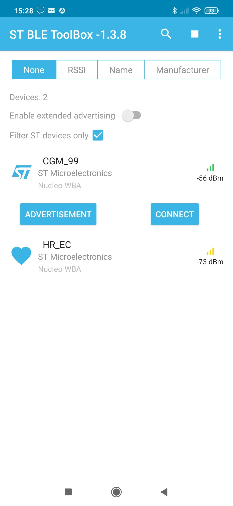
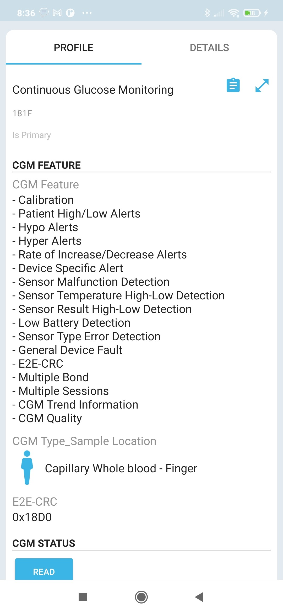
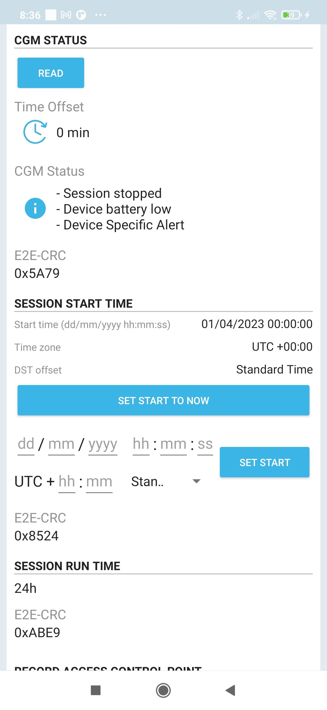
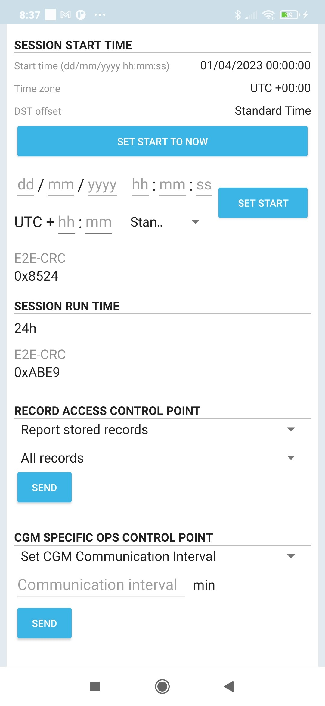
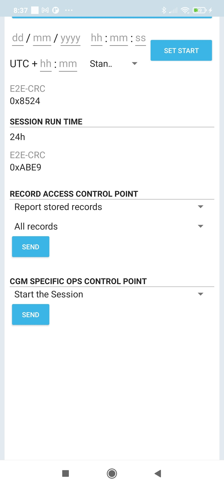
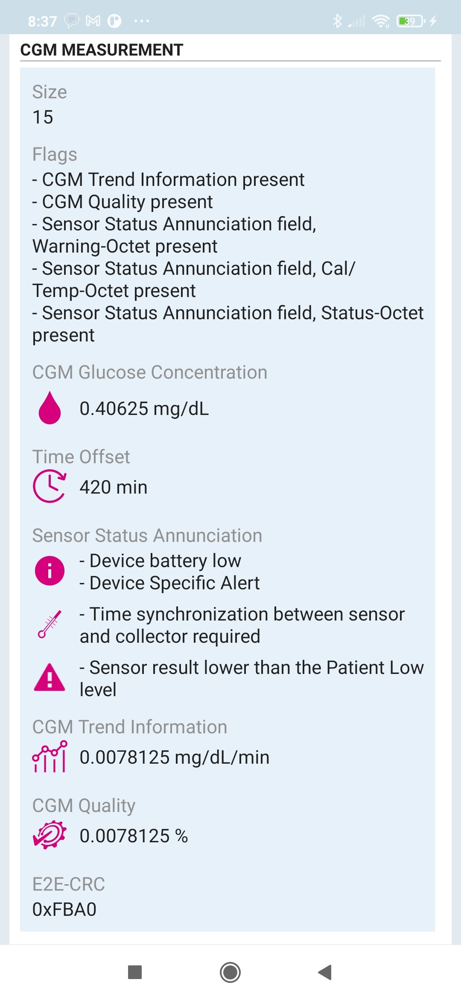
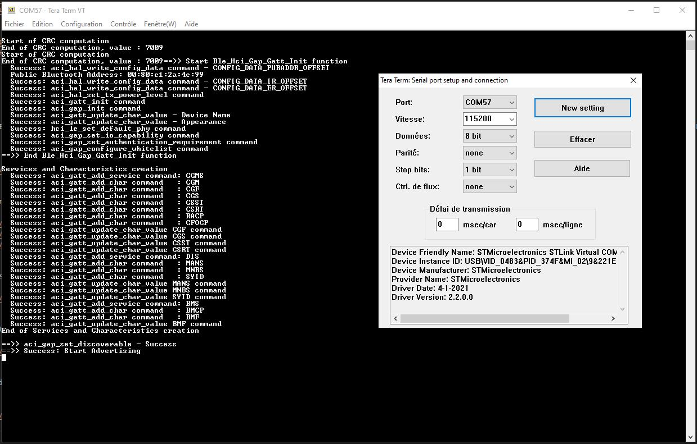

# STM32WBA-BLE-Continuous-Glucose-Monitoring

* The STM32WBA-BLE-Continuous-Glucose-Monitoring demonstrating Bluetooth® SIG [Continuous Glucose Monitoring Profile 1.0.2](https://www.bluetooth.com/specifications/cgmp-1-0-2/) example, based on STM32CubeWBA V1.3.1
 
## Hardware Needed

  * This example runs on STM32WBAxx devices.
  * Connect the Nucleo Board to your PC with a USB cable type A to mini-B to ST-LINK connector (USB_STLINK). 

## User's Guide

1) Run this Bluetooth® Low Energy Continuous Glucose Monitoring project where the STM32WBA will advertise

2) Use the ANDROID/IOS ST BLE Sensor application or ST BLE Toolbox application to connect with this Bluetooth® Low Energy [Continuous Glucose Monitoring Profile 1.0.2](https://www.bluetooth.com/specifications/cgmp-1-0-2/) (CGM_XX where XX is the 2 last digit of the Bluetooth® Device Address)
  
   Scan on ANDROID/IOS:
   

       
   

   After Connection, Pairing and Selecting the [Continuous Glucose Monitoring Service](https://www.bluetooth.com/wp-content/uploads/Files/Specification/HTML/CGMS_v1.0.2/out/en/index-en.html) on ANDROID/IOS you will see the following Characteristics:
   

       
       
       
   

   For example to start a measurement session Send the [Start the Session](https://www.bluetooth.com/wp-content/uploads/Files/Specification/HTML/CGMS_v1.0.2/out/en/index-en.html#UUID-48042aa0-52d0-feb5-81cc-48c96a05b24d) command in the [CGM SPECIFIC OPS CONTROL POINT](https://www.bluetooth.com/wp-content/uploads/Files/Specification/HTML/CGMS_v1.0.2/out/en/index-en.html#UUID-4b3ad8b2-5baf-5dfc-e5ac-0b665b777b9b) Characteristic on ANDROID/IOS:
   

       
   

   To following measurement in the [Continuous Glucose Monitoring Measurement](https://www.bluetooth.com/wp-content/uploads/Files/Specification/HTML/CGMS_v1.0.2/out/en/index-en.html#UUID-128fccb6-21df-2161-9687-efd71eed1972) Characteristic is shown on ANDROID/IOS:
   

       
   

	
3) Use terminal programs like Tera Term to see the logs of each board via the onboard ST-Link. (115200/8/1/n)

   

       
   

## Troubleshooting

**Caution** : Issues and the pull-requests are **not supported** to submit problems or suggestions related to the software delivered in this repository. The STM32WBA-BLE-Continuous-Glucose-Monitoring example is being delivered as-is, and not necessarily supported by ST.

**For any other question** related to the product, the hardware performance or characteristics, the tools, the environment, you can submit it to the **ST Community** on the STM32 MCUs related [page](https://community.st.com/s/topic/0TO0X000000BSqSWAW/stm32-mcus).